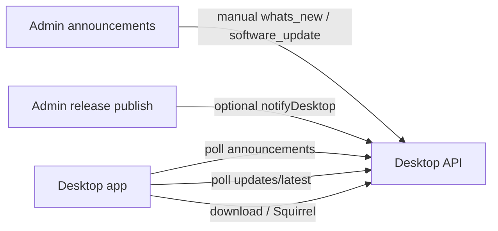

# Desktop client design (sync contract)

Normative contract for every Khepree desktop app. Implement against `@khepree/sdk` types and the HTTP surface in [`DESKTOP-INTEGRATION.md`](./DESKTOP-INTEGRATION.md). This document covers auth, **bản quyền / entitlement**, product-scoped announcements, and software updates so clients stay aligned with the platform.

API base: `https://api.khepree.com` (dev: `http://localhost:3004`).

---

## 1. Identity / OAuth PKCE

1. Open system browser to `account.khepree.com/desktop/authorize?...` with PKCE.
2. Receive auth code on allowlisted custom-scheme redirect.
3. `POST /api/v1/desktop/auth/exchange` → access + refresh tokens.
4. `POST /api/v1/desktop/activate` with Bearer access token (device registration).
5. Persist device private key in OS secure storage; never send the private key to Khepree.
6. Every `refresh` / `heartbeat`: sign device proof (session id, timestamp, nonce, method, path, body SHA-256).
7. `POST /api/v1/desktop/auth/logout` when signing out.

Windows unpackaged Electron must register the protocol with `execPath` + app entry (see INTEGRATION).

---

## 2. Bản quyền / entitlement

### Source of truth

Khepree is the source of truth for identity, entitlements, devices, and signed leases. Desktop never stores Khepree passwords and never holds the license signing private key.

### Endpoints

| Call | Purpose |
|------|---------|
| `POST /activate` | Bind device; receive lease when applicable |
| `GET /me` | Session snapshot: user, client, product, entitlement, plan, device, billing, `allowedActions`, URLs |
| `POST /heartbeat` | Liveness + machine state |
| `POST /auth/refresh` | Rotate tokens; re-check entitlement |

### Feature gating

- **Never** authorize with `if (plan === "PRO")`.
- Gate features with keys from `entitlement.features` / lease feature snapshot (`FeatureValue` in `@khepree/sdk`).

### Heartbeat / machine states

`DesktopHeartbeatResult.state` (`@khepree/desktop-auth` / session flow):

| State | Required UX |
|-------|-------------|
| `ACTIVE` | Normal operation |
| `ENTITLEMENT_MISSING` | Prompt checkout / activate |
| `ENTITLEMENT_SUSPENDED` | Block product use; show account billing |
| `ENTITLEMENT_EXPIRED` | Prompt renew |
| `DEVICE_REMOVED` / `DEVICE_BLOCKED` | Force re-auth / contact support |
| `SESSION_REVOKED` | Clear tokens; login again |

Map API errors via `DESKTOP_ERROR_CODES` (`DEVICE_LIMIT_REACHED`, `DEVICE_TRANSFER_COOLDOWN`, …).

### Device limits

Honor `/me.deviceUsage` and `allowedActions.manageDevices`. Open `urls.manageDevices` in the system browser — do not invent device admin UI against private APIs.

---

## 3. Thông báo theo sản phẩm

### Poll

```
GET /api/v1/desktop/announcements
  ?clientId=&appVersion=&platform=&architecture=&channel=stable&locale=vi
```

- Auth: Bearer access token.
- **Product scope is server-side** from `desktop_clients.product_id`. Do not send `productId`.
- Targeting may also filter platform, architecture, channel, SemVer window, schedule.

### Receipts

| Action | Endpoint |
|--------|----------|
| Mark read | `POST .../announcements/{publicId}/read` |
| Dismiss | `POST .../announcements/{publicId}/dismiss` |

Dismissed items are omitted from later polls. Mark read when the user opens the item.

### Rendering lanes (`type`)

| Type | UI |
|------|-----|
| `general` (default if absent) | Standard notification list |
| `whats_new` | What's New / release notes panel (not an urgent modal) |
| `urgent` | Elevated modal; only with `error` / `action_required` severity |

### CTA handling

| `cta.kind` | Client behavior |
|------------|-----------------|
| `none` | No button |
| `open_url` | Open first-party HTTPS URL (payload `url`) in system browser |
| `open_path` | Open in-app route or map safe path (payload `path`) |
| `software_update` | See §4 — render buttons from `actions` |

`software_update` payload (`DesktopSoftwareUpdateCtaPayload`):

```ts
{
  releasePublicId: string;
  actions: ("download" | "auto_update")[]; // default both when present from server
}
```

- Prefer `ctaLabel` for primary label when a single action; for dual actions use localized defaults (“Tải về” / “Tự động cập nhật”).
- Always re-check `/updates/latest` before downloading — announcement may be stale relative to the newest published release.

---

## 4. Cập nhật phần mềm

### Check for updates

```
GET /api/v1/desktop/updates/latest
  ?clientId=&currentVersion=&platform=&architecture=&channel=stable&locale=vi
```

- Returns `{ update: DesktopLatestUpdate | null }`.
- Entitlement required (or product on `DESKTOP_PUBLIC_UPDATE_PRODUCT_IDS` allowlist).
- Honor `mandatoryUpdate` and `minimumSupportedVersion`: lock the app behind an update gate when below the floor or when mandatory.

### Download

```
POST /api/v1/desktop/updates/download
Body: { clientId, releasePublicId, artifactPublicId }
→ { downloadUrl, expiresAt, ... }
```

- Prefer artifact `kind: "installer"` for the **Tải về** button.
- Verify `sha256` after download before install.
- Tickets are short-lived; do not cache forever.

### Auto-update (Windows Squirrel)

1. `POST /api/v1/desktop/updates/squirrel-feed-ticket`
2. `buildSquirrelFeedUrl({ apiBaseUrl, productSlug, architecture, channel, feedTicket })`
3. `autoUpdater.setFeedURL({ url: feedBaseUrl })` and check/download/install per Electron Squirrel.

macOS/Linux: treat **Tự động cập nhật** as download installer + guided relaunch until a native feed exists.

### Relation to announcements

- Admin may auto-create a `whats_new` + `software_update` CTA when publishing a release (checkbox on release publish), or create announcements manually under Admin → Thông báo hệ thống.
- **Version truth** = update APIs / Squirrel, not announcement body text.

---

## 5. Recommended client loops

| Loop | Cadence | Notes |
|------|---------|-------|
| Heartbeat | ~5–15 min while app foreground | Back off on network errors; map machine state |
| Token refresh | Before access expiry | Device proof required |
| Announcements | Startup + every 30–60 min | Skip when offline; debounce |
| Updates | Startup + every 6–24 h | Immediate check when user opens Settings → Updates |
| Checkout status | While pending | Poll until terminal status |

Offline: show last-known entitlement; do not invent grants. Queue dismiss/read locally if needed, flush when online.

---

## 6. Error codes

Use `DESKTOP_ERROR_CODES` and `LICENSE_ERROR_CODES` from `@khepree/sdk`. Surface user-facing copy for:

- `AUTH_REQUIRED`, `SESSION_EXPIRED`, `SESSION_REVOKED`
- `DEVICE_*`, `ENTITLEMENT_*`
- `ANNOUNCEMENT_NOT_FOUND`, `RELEASE_NOT_FOUND`, `ARTIFACT_NOT_FOUND`
- `DOWNLOAD_NOT_AUTHORIZED`, `DOWNLOAD_TICKET_REPLAY`

---

## 7. Registration

Each app needs a `desktop_clients` row (`client_id`, `product_id`, redirect URIs, protocol). Production SQL scripts:

| App | Script |
|-----|--------|
| Livestream AI | `scripts/register-livestream-ai-desktop-client.sql` |
| TTS Batch AI | `scripts/register-tts-batch-ai-desktop-client.sql` |
| Batch Chat AI | `scripts/register-batch-chat-ai-desktop-client.sql` |

Also mirrored in `packages/db/src/seed/index.ts` for local seed.

---

## 8. Admin ↔ desktop sync summary



Keep clients on this contract; do not fork product-scoped notification tables or bespoke update channels per app.
