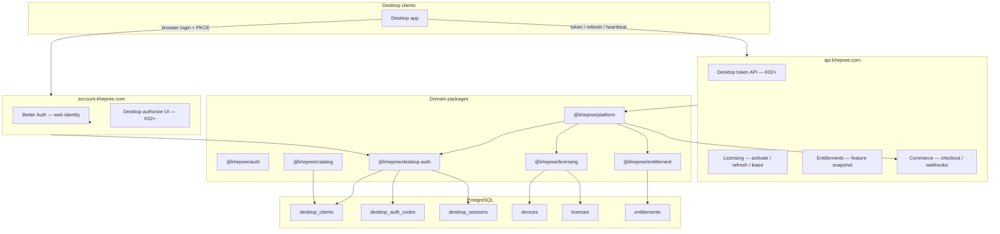
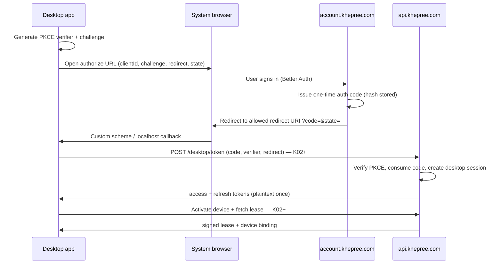
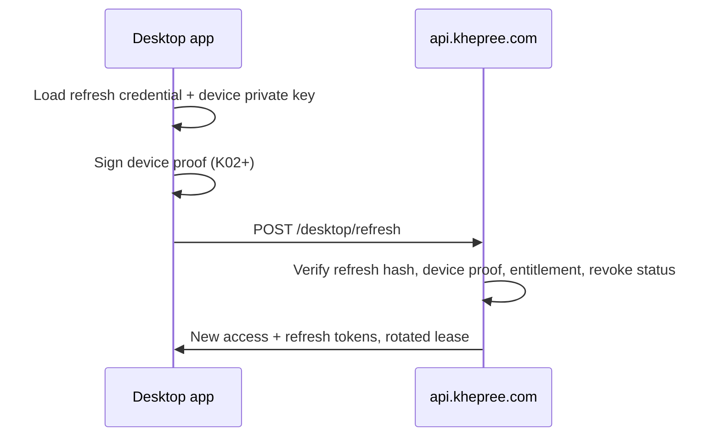

# Desktop ecosystem (Phase K01)

Khepree is the **source of truth** for identity, entitlements, devices, payments, and signed license leases. Desktop applications (e.g. NovelTrans Studio) are **clients** — they never store Khepree passwords and never hold the license signing private key.

Phase K01 establishes generic persistence and SDK contracts. OAuth endpoints, device proof enforcement, and lease issuance land in later phases (K02+).

## Domain diagram



## Separation of concerns

| Layer | Responsibility | Package |
|-------|----------------|---------|
| Web identity | Email/password, Google OAuth, MFA | `@khepree/auth` (Better Auth) |
| Desktop identity | Authorization code + PKCE + desktop session | `@khepree/desktop-auth` |
| Access rights | Feature snapshot, grant/suspend/revoke | `@khepree/entitlement` |
| Device + lease | Activation, Ed25519 lease, device limits | `@khepree/licensing` |
| Product binding | Which app maps to which product | `desktop_clients.product_id` → catalog |

**Auth ≠ Entitlement ≠ License.** Desktop sessions authenticate the user; entitlements decide what they may use; licenses and leases are projections for offline-capable desktop verification.

## Auth flow (first launch)



Rules (K01 persistence enforces the code half):

- Authorization codes are **one-time**, **short TTL** (default 5 minutes), stored as **SHA-256 hash** only.
- **PKCE S256** required; plaintext code never persisted.
- **Exact redirect URI** must match an entry in `desktop_clients.allowed_redirect_uris`.

## Session flow (return visits)



Desktop session fields (`desktop_sessions`):

- Tokens stored as **hashes** only (`access_token_hash`, `refresh_token_hash`).
- `device_id` nullable until activation binds an installation.
- `device_public_key` stored when the client registers its Ed25519 public key.
- `rotation_version` supports refresh token rotation / reuse detection (K02+).
- `revoked_at` + `revoke_reason` for sign-out and admin revoke.

Default TTLs (`@khepree/config`):

| Token | Default |
|-------|---------|
| Authorization code | 300 s (5 min) |
| Access token | 900 s (15 min) |
| Refresh credential | 30 days |

## Device binding

Each installation generates an **Ed25519 keypair** locally. The server receives:

- `installationId` (hashed into `devices.installation_hash` — existing Phase 08 model)
- Device **public** key (on `desktop_sessions.device_public_key`, bound after activate)
- Optional platform / display name metadata

The server **never** receives the device private key.

Device proof canonical payload (K02+ enforcement):

```
KHEPREE-DESKTOP-V1
{sessionPublicId}
{timestamp}
{nonce}
{HTTP method}
{path}
SHA256(canonical request body)
```

Signed with the device private key; verified server-side against `device_public_key`. Nonces are one-time with Redis backing in production.

## Entitlement flow

1. Commerce webhook confirms payment → outbox → entitlement grant (existing).
2. Desktop session is scoped to `desktop_clients.product_id`.
3. Live APIs re-check entitlement status before refresh/heartbeat.
4. Signed lease (`@khepree/licensing`) embeds a feature snapshot for offline use within TTL + grace.

Feature checks use keys like `devices.max` — never `if (plan === "PRO")`.

## Payment flow

Desktop clients do **not** embed checkout. When entitlement is missing or expired:

1. Client opens account.khepree.com checkout in the browser (product/plan from catalog).
2. Payment completes via SePay webhook → entitlement grant.
3. Desktop refresh picks up the new entitlement and re-issues lease.

Error code `PAYMENT_PENDING` covers in-flight checkout; `CHECKOUT_NOT_AVAILABLE` when catalog blocks purchase.

## Threat model

| Threat | Mitigation |
|--------|------------|
| Stolen authorization code | PKCE S256; short TTL; one-time consume |
| Redirect hijacking | Exact allowlist per `desktop_clients` |
| Token database leak | Only SHA-256 hashes stored |
| Refresh token reuse | Rotation + `REFRESH_TOKEN_REUSED` (K02+) |
| Replay of device proof | Timestamp window ±120 s + one-time nonce (Redis) |
| Offline abuse after revoke | Lease cryptographically valid until `exp`; live APIs deny refresh |
| Client impersonation | Registered `clientId` + product binding; inactive clients rejected |

## Token storage rules

**Server (PostgreSQL):**

- `desktop_auth_codes.code_hash` — never plaintext code
- `desktop_sessions.access_token_hash` / `refresh_token_hash` — never plaintext tokens

**Desktop client (local secure storage — client responsibility):**

- Refresh credential
- Device private key
- Session public id
- Optional cached lease until refresh

**Never on desktop:**

- Khepree account password
- License signing private key
- Web session cookies from Better Auth

## Revocation semantics

| Action | Desktop session | Device slot | Reactivation |
|--------|-----------------|-------------|--------------|
| **Sign out** | Revoke current session | Slot retained | Same device can refresh if session re-created |
| **Remove / deactivate device** | Revoke all sessions for device | Slot freed | User self-service; transfer policy applies |
| **Block device** (admin) | Revoke sessions | Slot freed | User cannot unblock; admin only |

History is retained — devices are not hard-deleted on remove.

## Desktop client registry

`desktop_clients` binds a public `client_id` (e.g. `dev-desktop-sample` in seed) to a catalog `product_id`:

| Field | Purpose |
|-------|---------|
| `client_id` | Public identifier sent by desktop apps |
| `product_id` | Catalog product for entitlement scope |
| `allowed_redirect_uris` | Exact OAuth redirect allowlist |
| `status` | `active` / `inactive` |

Register new desktop products via admin or seed — do not hard-code product names in application code.

## SDK contract

Public types and error codes live in `@khepree/sdk` (`DesktopClient`, `DesktopAuthExchangeRequest`, `DesktopMeResponse`, `DESKTOP_ERROR_CODES`, …). DB row shapes are **not** exported to API consumers.

## Dependency direction

```
apps → @khepree/platform → @khepree/desktop-auth → @khepree/db
                         → @khepree/licensing
                         → @khepree/entitlement
```

`@khepree/desktop-auth` does not import commerce or licensing implementations. Platform wiring arrives in K02.

## Phase K01 deliverables

- Schema: `desktop_clients`, `desktop_auth_codes`, `desktop_sessions` (migration `0016_phase_k01_desktop_ecosystem`)
- Package: `@khepree/desktop-auth` (hash, PKCE, repository, service)
- Config TTL constants: `@khepree/config/desktop-auth`
- SDK types + machine error codes
- Dev seed client: `dev-desktop-sample` → development-sample product

## Phase K02 deliverables

- Account authorize UI: `GET /desktop/authorize` on `account.khepree.com`
- Token exchange API: `POST /api/v1/desktop/auth/exchange` on `api.khepree.com`
- Rate limits: `DESKTOP_AUTHORIZE`, `DESKTOP_EXCHANGE`
- Audit events: `DESKTOP_AUTHORIZED`, `DESKTOP_SESSION_CREATED`, `DESKTOP_AUTH_FAILED`
- Login succeeds without entitlement; response includes `entitlementAccess`

## Phase K03 deliverables

- Account-based activation: `POST /api/v1/desktop/activate` (Bearer desktop access token)
- `LicensingService.activateByPrincipal` — no license key on wire; provisions internal license record when required
- Session binding: `desktop_sessions.device_id` updated after activation
- Ed25519 signed lease via existing `@khepree/licensing` signer
- Rate limit: `DESKTOP_ACTIVATE`
- Audit: `DESKTOP_DEVICE_ACTIVATED`
- Legacy `/api/v1/licenses/activate` unchanged

## Phase K04 deliverables

- Device-bound refresh: `POST /api/v1/desktop/auth/refresh` (refresh credential + session public id + Ed25519 device proof)
- Heartbeat: `POST /api/v1/desktop/heartbeat` (access token + device proof → machine state)
- Logout: `POST /api/v1/desktop/auth/logout` (revokes session only; device slot retained)
- Refresh rotation with CAS on `refresh_token_hash`; reuse revokes the session and emits `DESKTOP_REFRESH_TOKEN_REUSED`
- Nonce replay protection via injectable `NonceStore` (memory in dev/tests; Redis in production when wired)
- Rate limits: `DESKTOP_REFRESH`, `DESKTOP_HEARTBEAT`, `DESKTOP_LOGOUT`

### Refresh token reuse policy (K04)

When a refresh credential is presented after rotation, the server:

1. Rejects the request with `REFRESH_TOKEN_REUSED`
2. Revokes **that desktop session** (`revoke_reason = refresh_token_reused`)
3. Records audit `DESKTOP_REFRESH_TOKEN_REUSED`

We do **not** revoke sibling sessions or free the device slot — each `desktop_sessions` row is an independent credential chain (`rotation_version` is audit metadata only). Stolen refresh tokens cannot be silently replayed after a legitimate rotation; the legitimate client keeps the new credential.

### Cold start & offline revocation

Desktop clients should call refresh or heartbeat on cold start for live entitlement/device/session checks. Signed leases may still grant temporary runtime grace per `@khepree/licensing` offline policy — **leases are not instant offline revocation**. Revocation takes effect on the next successful live API call or when the lease expires (including grace).

## Phase K05 deliverables

- Account device management UI: `account.khepree.com/devices` grouped by product with slots used/max, first activated, last active, current-device marker (via `?currentDevice=` — no hardware fingerprint shown)
- Self-service remove: `LicensingService.removeDevice` — ownership check, cooldown, transfer quota from features (`devices.transfers.max`, `devices.transfers.window_days`), activation revoke, desktop session + refresh revoke, soft remove (`removed_at`, `removed_by_user_id`), audit + `device_removal_events`
- Step-up auth: server-enforced `assertRecentAuth()` (session `updated_at` within 15 minutes); account remove redirects to sign-in when stale
- Device limit UX: `DEVICE_LIMIT_REACHED` includes `{ used, max, manageDevicesUrl }` (no secrets)
- Admin `blockDevice` remains distinct from owner remove (`DEVICE_BLOCKED`, no `removed_at`)

## Related docs

- `docs/ARCHITECTURE.md` — package boundaries
- `docs/LICENSE-SIGNING.md` — Ed25519 lease keys
- `docs/SPEC-phase-08-entitlement-licensing.md` — devices and leases
- `CONSTRAINTS.md` — non-negotiable rules
